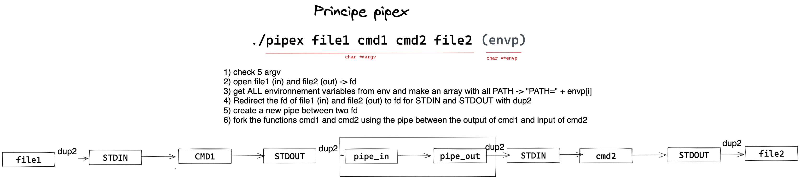
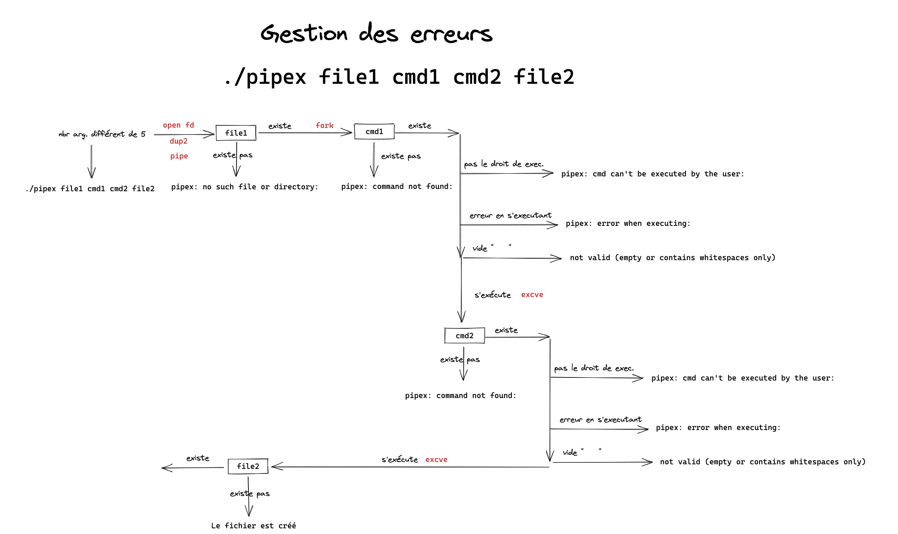
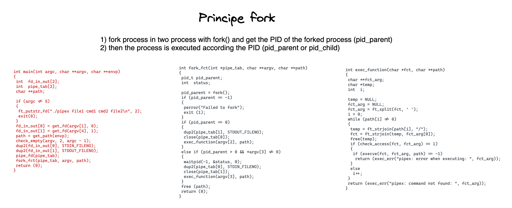

# Fichier commenté
[Archive contenant des commentaires et le code sur une page](./srcs/pipex_all_with_comments.c)

# Principe de pipex

# Gestion des erreurs (simplifiée)

# Fork

# Donnée de l'exercice
[pipex.pdf](<./ressources/00P42 - Pipex.pdf>)